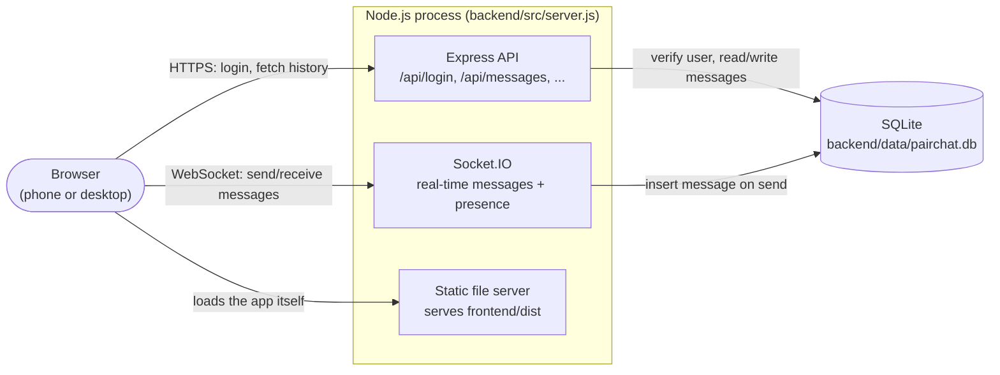
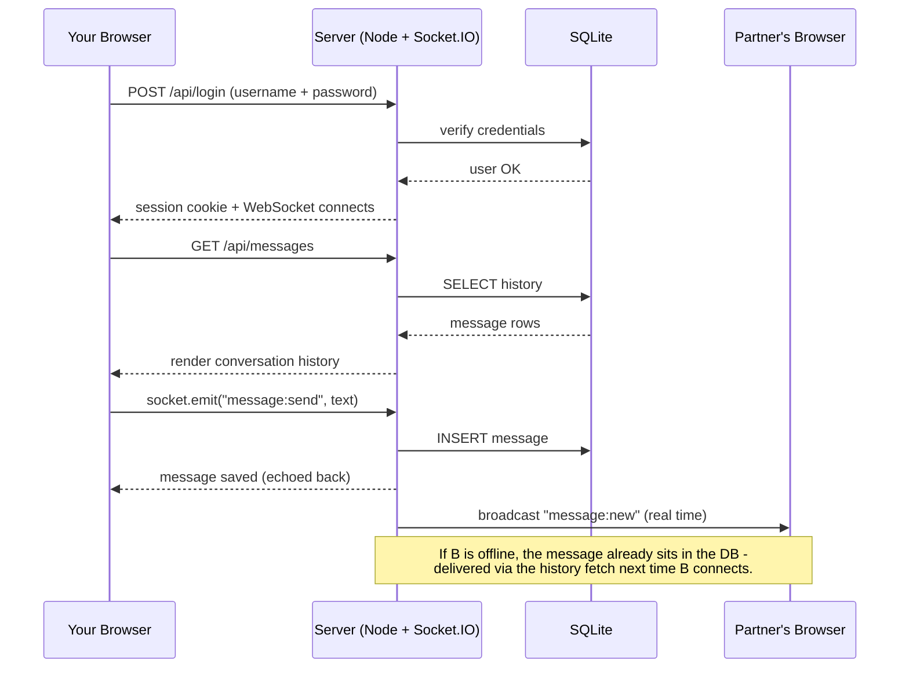

# PairChat architecture

One conversation, two accounts, one process serving all of it.

## Component map



In development, the frontend runs on its own Vite dev server (`localhost:5173`) for hot-reload and talks to the backend (`localhost:4000`) over CORS. In production, `npm run build` produces `frontend/dist`, and the backend serves those files itself — one process, one port, one thing to deploy (see [Dockerfile](../Dockerfile)).

## Message flow



## Why it's built this way

| Decision | Reason |
|---|---|
| One room, two fixed accounts | There is exactly one conversation, ever. No contact list, no groups, no signup flow to build or secure. |
| SQLite, one file | At two users, a managed database is pure overhead. The whole conversation is one file — trivial to back up (copy it) or inspect (`sqlite3 pairchat.db`). |
| Backend serves the built frontend | Removes a second service, a second CORS surface, and a second deploy step. `CLIENT_ORIGIN`/CORS only matters in local dev, where Vite's dev server runs separately for hot-reload. |
| Socket.IO over raw WebSocket | Automatic reconnect handling — a phone switching from Wi-Fi to mobile data shouldn't lose the session. |
| JWT in an httpOnly cookie | Simple, stateless sessions without a server-side session store; not readable from JavaScript, which is what actually matters for XSS resistance here. |

## Where the pieces live

```
pairchat/
├── Dockerfile              multi-stage: builds frontend, runs backend
├── docker-compose.yml      local containerized run, with a data volume
├── fly.toml                Fly.io deploy config (recommended host)
├── setup.bat               one-time install + .env + seed
├── run.bat                 one-click local start (dev mode)
├── backend/
│   ├── src/
│   │   ├── server.js       Express + Socket.IO + static frontend serving
│   │   ├── auth.js         login, JWT cookie, socket auth middleware
│   │   ├── db.js           SQLite connection + schema
│   │   └── seed.js         creates/updates the two accounts
│   └── data/               pairchat.db lives here (gitignored)
└── frontend/
    └── src/
        ├── App.jsx         auth-state switch between Login and Chat
        ├── Login.jsx
        ├── Chat.jsx        history fetch, socket listeners, composer
        ├── api.js          fetch wrapper (credentials: include)
        └── socket.js       Socket.IO client singleton
```

See the root [README.md](../README.md) for setup and deployment instructions.
